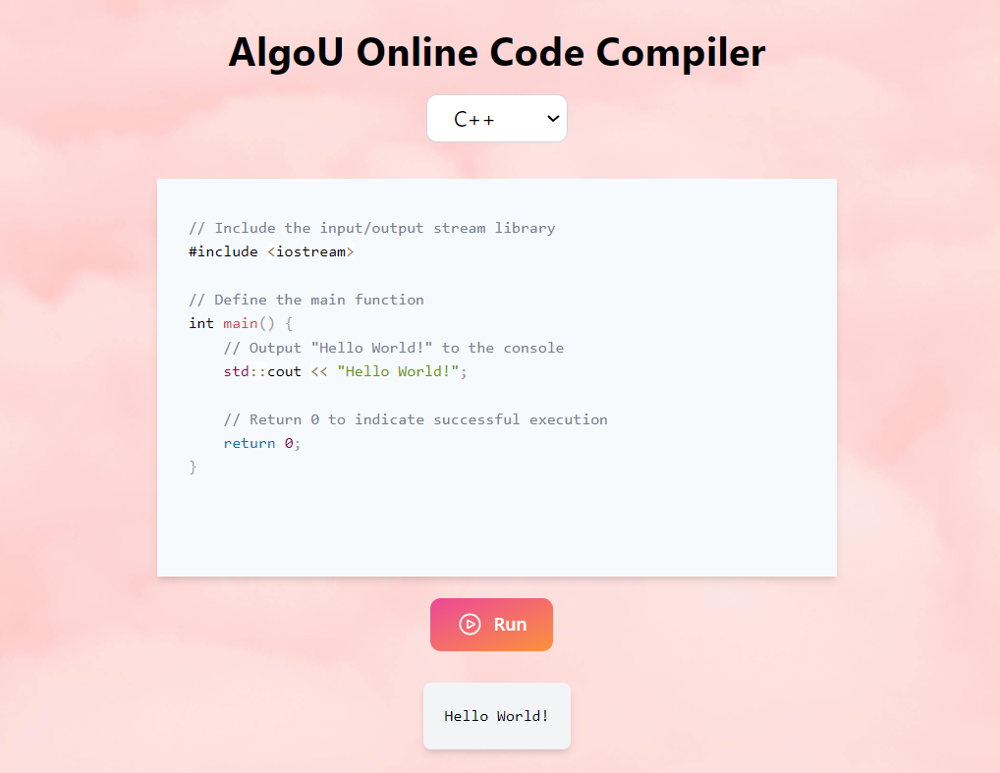

# AlgoU Online Compiler

An end-to-end web application that lets you write, compile, and execute code directly in the browser.

The project is split into two independently runnable parts:

1. **backend** - A lightweight FastAPI server that receives source code, stores it temporarily, compiles it with `g++`, then returns the program output to the client.
2. **frontend** - A React + Vite single-page application that provides a minimal online IDE and communicates with the backend through REST.

## Features

- Live browser code editing powered by `react-simple-code-editor` and Prism syntax highlighting.
- One-click **Run** button that posts code to the API and displays the output below the editor.
- Email/password authentication with bearer tokens.
- CRUD for saved C++ submissions per logged-in user.
- AI code review for authenticated users using the Gemini Flash model.
- Modular execution pipeline. Only C++ is wired up right now, but more languages can be added with separate executor helpers.

## Installation

These commands assume you have **Node.js 18+**, **npm**, **Python 3.10+**, and `g++` installed.

```bash
git clone https://github.com/your-username/AlgoU-Online-Compiler.git
cd AlgoU-Online-Compiler
```

Install the FastAPI backend dependencies:

```bash
cd backend
python -m venv .venv
.venv\Scripts\activate
pip install -r requirements.txt
```

Install the React frontend dependencies:

```bash
cd ..\frontend
npm install
```

## Running The Project

Open two terminals, one for each side of the stack.

Terminal 1 - API:

```bash
cd backend
.venv\Scripts\activate
uvicorn main:app --reload --host 0.0.0.0 --port 8000
```

Terminal 2 - React SPA:

```bash
cd frontend
npm run dev
```

The React app should call the API at:

```env
VITE_API_URL=http://localhost:8000
```

Set these backend variables for AI review:

```env
GEMINI_API_KEY=your_gemini_api_key_here
GEMINI_MODEL=gemini-1.5-flash
```

## API Endpoints

- `POST /auth/register` - create a user and return a token.
- `POST /auth/login` - login and return a token.
- `GET /auth/me` - fetch the current user with `Authorization: Bearer <token>`.
- `POST /auth/logout` - delete the current token.
- `POST /submissions` - create a saved program.
- `GET /submissions` - list the logged-in user's programs.
- `GET /submissions/{id}` - read one saved program.
- `PUT /submissions/{id}` - update one saved program.
- `DELETE /submissions/{id}` - delete one saved program.
- `POST /ai/review` - review C++ code with Gemini Flash. Requires `Authorization: Bearer <token>`.

## Example Usage

1. Type or paste C++ code into the editor.
2. Click **Run**.
3. The program output appears below the editor.



## Dependencies

Backend:

- fastapi
- uvicorn
- python-dotenv

Frontend:

- react + react-dom
- vite
- react-simple-code-editor
- prismjs
- tailwindcss + postcss + autoprefixer

## Important Security Note

This project executes user-submitted code. FastAPI improves the API structure, but it does not sandbox code execution. Do not expose this backend publicly without container isolation, strict resource limits, cleanup jobs, and input/output controls.
